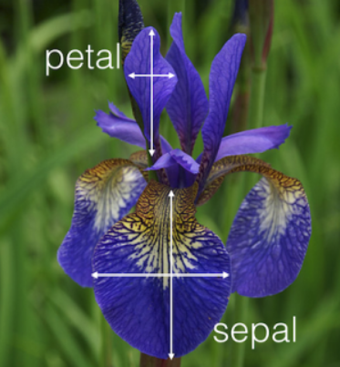
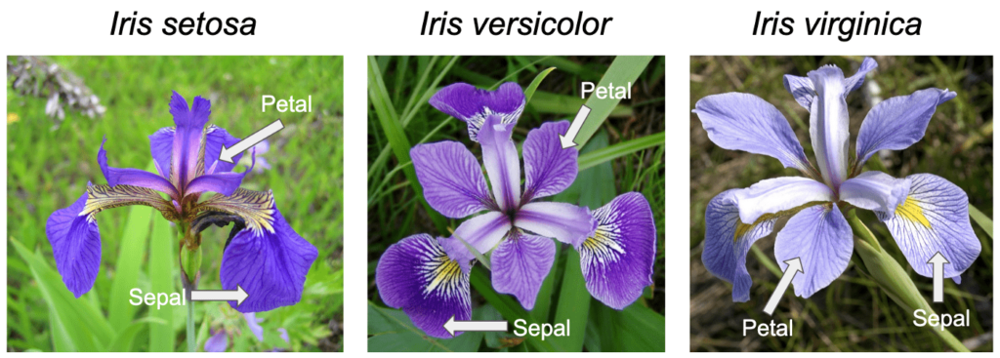

# Iris Classification

## Introduction

The Iris flower dataset is one of the most well-known datasets in machine learning and statistics. It consists of measurements of iris flowers from three different species. This documentation explains the purpose, significance, and implementation of a machine learning model that classifies iris flowers based on their features.

## Purpose

The purpose of this project is to demonstrate a simple yet effective machine learning model that can classify iris flowers into their respective species using measurable characteristics such as sepal length, sepal width, petal length, and petal width.



## Goal

The goal is to train a decision tree classifier to accurately predict the species of an iris flower based on its physical attributes. The model's performance is evaluated using accuracy and a classification report.

## What is the Iris Plant?

The Iris is a genus of flowering plants with over 300 species. The dataset focuses on three species:

* Iris setosa
* Iris versicolor
* Iris virginica



These flowers are widely studied in botany and data science due to their distinct and measurable features.

## How Does It Affect Us?

While iris flowers are primarily ornamental, their classification problem serves as an excellent introduction to:

1. Pattern recognition
2. Supervised machine learning
3. Feature-based classification

This dataset is often used for teaching data science concepts, helping students and professionals understand classification algorithms.

## Code

```python
from sklearn.datasets import load_iris
from sklearn.model_selection import train_test_split
from sklearn.tree import DecisionTreeClassifier
from sklearn.metrics import accuracy_score, classification_report

# Load the iris dataset
iris = load_iris()
X = iris.data
y = iris.target

print(iris.DESCR)

# Split the dataset into training and testing sets
X_train, X_test, y_train, y_test = train_test_split(X, y, test_size=0.3)

# Initialize the classifier
clf = DecisionTreeClassifier()

# Train the model
clf.fit(X_train, y_train)

# Predict on test data
y_pred = clf.predict(X_test)

# Evaluate the model
print("Accuracy:", accuracy_score(y_test, y_pred))
print("Classification Report:\n", classification_report(y_test, y_pred, target_names=iris.target_names))
```

## Result

```
.. _iris_dataset:

Iris plants dataset
--------------------

**Data Set Characteristics:**

:Number of Instances: 150 (50 in each of three classes)
:Number of Attributes: 4 numeric, predictive attributes and the class
:Attribute Information:
    - sepal length in cm
    - sepal width in cm
    - petal length in cm
    - petal width in cm
    - class:
            - Iris-Setosa
            - Iris-Versicolour
            - Iris-Virginica

:Summary Statistics:

============== ==== ==== ======= ===== ====================
                Min  Max   Mean    SD   Class Correlation
============== ==== ==== ======= ===== ====================
sepal length:   4.3  7.9   5.84   0.83    0.7826
sepal width:    2.0  4.4   3.05   0.43   -0.4194
petal length:   1.0  6.9   3.76   1.76    0.9490  (high!)
petal width:    0.1  2.5   1.20   0.76    0.9565  (high!)
============== ==== ==== ======= ===== ====================

:Missing Attribute Values: None
:Class Distribution: 33.3% for each of 3 classes.
:Creator: R.A. Fisher
:Donor: Michael Marshall (MARSHALL%PLU@io.arc.nasa.gov)
:Date: July, 1988

The famous Iris database, first used by Sir R.A. Fisher. The dataset is taken
from Fisher's paper. Note that it's the same as in R, but not as in the UCI
Machine Learning Repository, which has two wrong data points.

This is perhaps the best known database to be found in the
pattern recognition literature.  Fisher's paper is a classic in the field and
is referenced frequently to this day.  (See Duda & Hart, for example.)  The
data set contains 3 classes of 50 instances each, where each class refers to a
type of iris plant.  One class is linearly separable from the other 2; the
latter are NOT linearly separable from each other.

.. dropdown:: References

  - Fisher, R.A. "The use of multiple measurements in taxonomic problems"
    Annual Eugenics, 7, Part II, 179-188 (1936); also in "Contributions to
    Mathematical Statistics" (John Wiley, NY, 1950).
  - Duda, R.O., & Hart, P.E. (1973) Pattern Classification and Scene Analysis.
    (Q327.D83) John Wiley & Sons.  ISBN 0-471-22361-1.  See page 218.
  - Dasarathy, B.V. (1980) "Nosing Around the Neighborhood: A New System
    Structure and Classification Rule for Recognition in Partially Exposed
    Environments".  IEEE Transactions on Pattern Analysis and Machine
    Intelligence, Vol. PAMI-2, No. 1, 67-71.
  - Gates, G.W. (1972) "The Reduced Nearest Neighbor Rule".  IEEE Transactions
    on Information Theory, May 1972, 431-433.
  - See also: 1988 MLC Proceedings, 54-64.  Cheeseman et al"s AUTOCLASS II
    conceptual clustering system finds 3 classes in the data.
  - Many, many more ...

Accuracy: 0.9111111111111111
Classification Report:
               precision    recall  f1-score   support

      setosa       1.00      1.00      1.00        15
  versicolor       0.76      1.00      0.87        13
   virginica       1.00      0.76      0.87        17

    accuracy                           0.91        45
   macro avg       0.92      0.92      0.91        45
weighted avg       0.93      0.91      0.91        45

```

## How the Code Works

* Load the Dataset: The code uses load_iris() from scikit-learn to import the

iris dataset.

* Split Data: The dataset is divided into training (70%) and testing (30%) sets.

* Train Model: A decision tree classifier (DecisionTreeClassifier) is trained on the training data.

* Predict & Evaluate: The model predicts species on the test set, and performance is measured using accuracy and a classification report.

* This simple yet powerful approach demonstrates how machine learning can classify real-world data efficiently.
